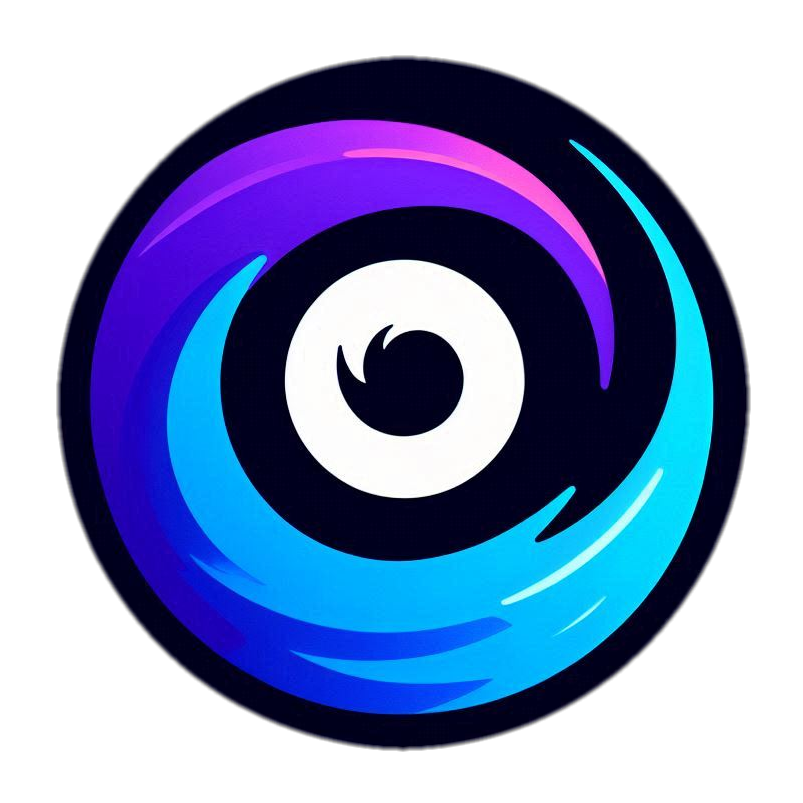
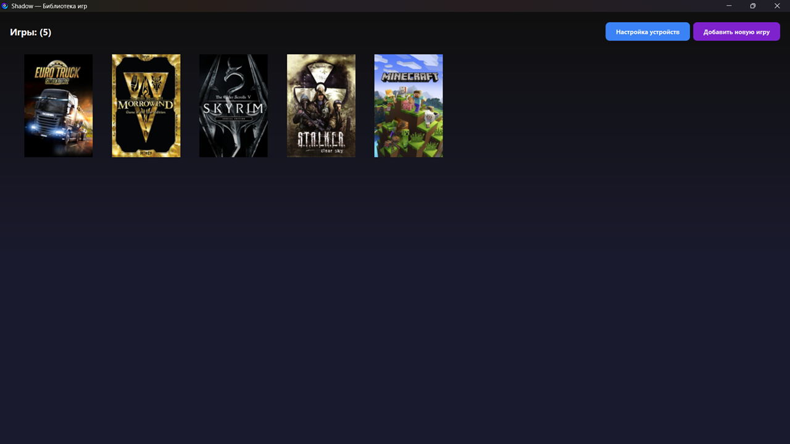
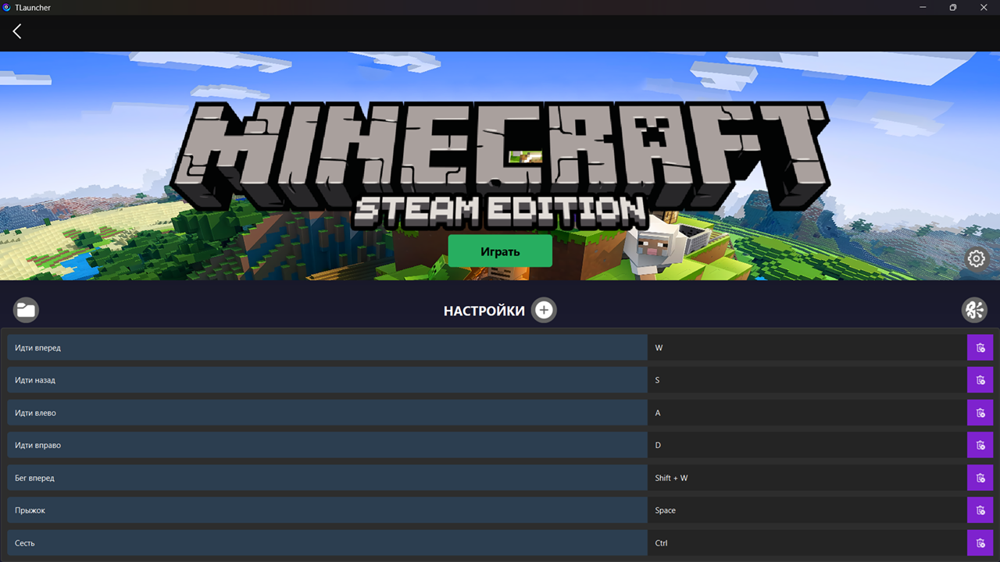
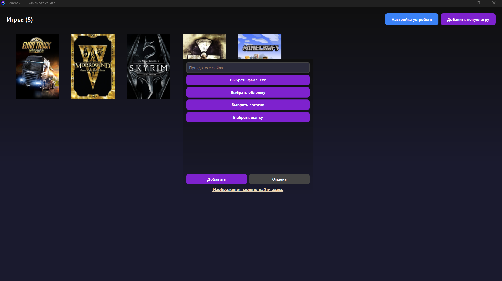
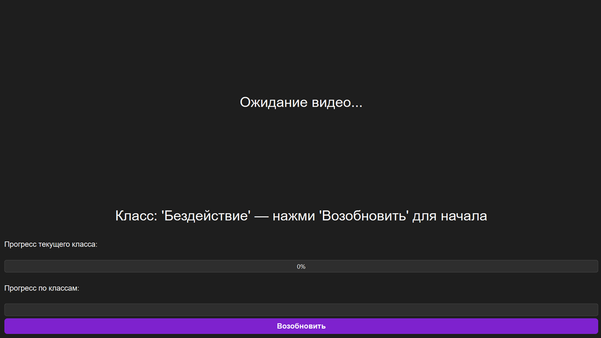
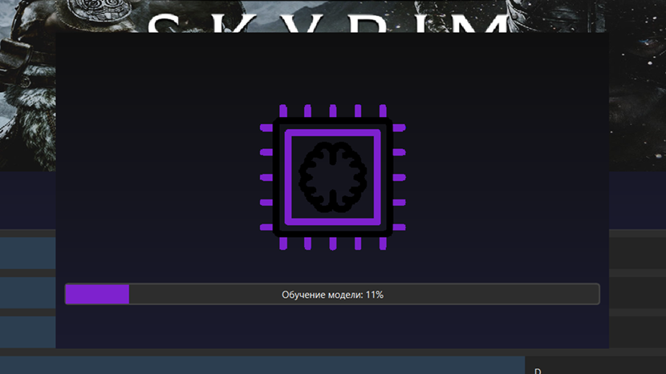

#  Shadow Control

## 📖 Описание

**Shadow Control** — это инновационная система управления играми, основанная на распознавании движений тела и речи с помощью камеры и микрофона. Вместо мыши и клавиатуры вы используете своё тело и речь, чтобы управлять персонажем: наклоны, шаги, повороты, жесты и слова превращаются в игровые действия.

## Структура проекта

- **app** - код приложения
- **polygon** — директория, в которой производилось с предварительная проверка функционала при разработке системы

## 🔧 Возможности

- **Распознавание позы в реальном времени**: с помощью MediaPipe Pose.
- **Классификация движений**: с использованием обученной LSTM-модели.
- **Интеграция с играми**: управление персонажем через движения тела.
- **Голосовое управление**: распознавание команд для взаимодействия с интерфейсом игры.
- **Удобный интерфейс** с возможностью обучения новых движений и настройки под любую игру.

## 🧩 Технологии

- **Python**, **PySide6** для реализации интерфейса
- **MediaPipe** — извлечение ключевых точек тела
- **PyTorch** — классификация действий
- **Vosk** — оффлайн-распознавание речи
- **Pydirectinput** — эмуляция клавиш
- **Flask**, **OBS** — отображение камеры

## 🖥️ Интерфейс
<h3>Главное меню с библиотекой игр</h3>

<h3>Окно игры с настройками управления и запуском</h3>

<h3>Добавление игры</h3>

<h3>Окно игры с настройками управления и запуском</h3>

<h3>Мастер сбора данных для обучения новых движений</h3>

<h3>Обучение модели классификации</h3>

## Установка

Для установки программы необходимо скачать [**архив**](https://drive.google.com/file/d/16hksGnPpRa9G9gEJ5yb1CZD44urnjqM5/view?usp=sharing) и распаковать его на устройстве.
Для работы программы на устройстве должны быть установлены: 
- [**NVIDIA Driver**](https://www.nvidia.com/en-us/drivers/) >= 460.32
- [**OBS**](https://obsproject.com/download) (опцианально)

## Развёртывание проекта
**Клонируйте репозиторий:**  
<pre><code>git clone https://github.com/OlegGayvoronsky/Shadow-Control.git  
cd Shadow-Control </code> </pre>
**Установите зависимости:**  
<pre><code>pip install -r requirements.txt </code> </pre>
**Запустите приложение:**  
<pre><code>python main.py </code> </pre>

## [**Скринкаст**](https://drive.google.com/file/d/1jbNMLJBURs8i-50FwHDhD5eOlGUM9PX1/view?usp=sharing) ##

## Авторы

- [Олег Гайворонский]

*Icons by [**icons8**](https://icons8.ru/)*
